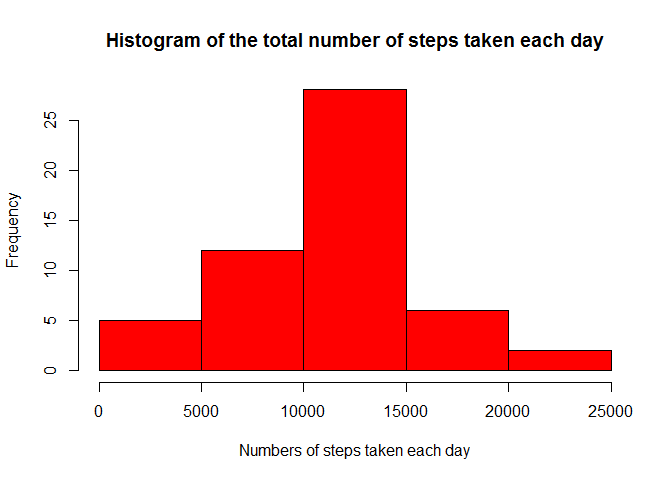
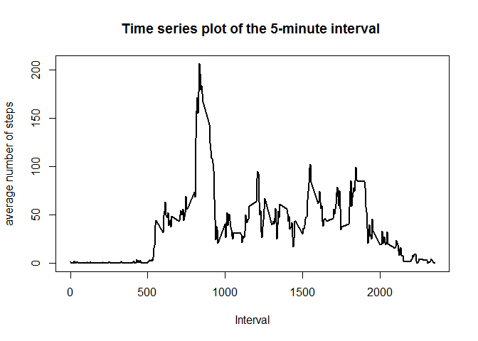
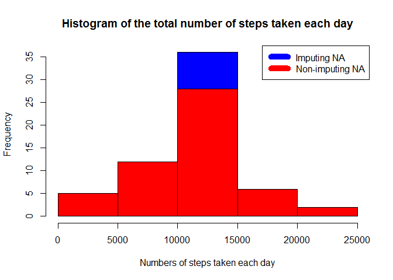
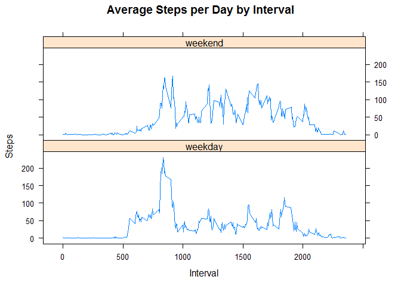

# Reproducible Research: Peer Assessment 1
## Loading and preprocessing the data
###Reading the dataset and processing the data

```r
setwd("D:/Downloads/R")
url="https://d396qusza40orc.cloudfront.net/repdata%2Fdata%2Factivity.zip"
download.file(url,destfile="Activity_data.zip")
unzip("Activity_data.zip")
library(readr)
activity <- read_csv("D:/Downloads/R/activity.csv")
```

```
## Parsed with column specification:
## cols(
##   steps = col_integer(),
##   date = col_date(format = ""),
##   interval = col_integer()
## )
```


## What is mean total number of steps taken per day?
###Histogram of the total number of steps taken each day

```r
step_date <- aggregate(steps ~ date,activity, sum)
hist(step_date$steps,
     ylab="Frequency",
     xlab="Numbers of steps taken each day",
     col="red",
     main="Histogram of the total number of steps taken each day"
)
```

<!-- -->

```r
#Mean and median number of steps taken each day
Mean_steps <- mean(step_date$steps)
Median_steps <- median(step_date$steps)
Mean_steps
```

```
## [1] 10766.19
```

```r
Median_steps
```

```
## [1] 10765
```

The mean of steps taken each day is 1.0766189\times 10^{4}. 
The median of steps taken each day is 10765.


## What is the average daily activity pattern?
###Time series plot of the average number of steps taken

```r
step_interval <-aggregate(steps ~ interval, activity, mean)
plot(step_interval$interval, step_interval$steps, 
     type = "l", lwd = 2,
     xlab = "Interval", 
     ylab = "average number of steps",
     main = "Time series plot of the 5-minute interval ")
```

<!-- -->

```r
Maximum <- step_interval[step_interval$steps==max(step_interval$steps),]
Maximum$interval
```

```
## [1] 835
```
The 5-minute interval that, on average, contains the maximum number of steps, is 835


## Imputing missing values
###Calculate and report the total number of missing values in the dataset

```r
na <- activity[activity$steps=="NA",]
nrow(na)
```

```
## [1] 2304
```
The total number of missing values in the dataset is 2304.

###Devise a strategy for filling in all of the missing values in the dataset:filling in the missing value by the mean of that 5-minute interval.

```r
new_data <- transform(activity, steps = ifelse(is.na(activity$steps), step_interval$steps[match(activity$interval, step_interval$interval)], activity$steps))
```

###Make a histogram to show the difference

```r
new_step_date <- aggregate(steps ~ date,new_data, sum)
hist(new_step_date$steps,
     ylab="Frequency",
     xlab="Numbers of steps taken each day",
     col="blue",
     main="Histogram of the total number of steps taken each day"
)

hist(step_date$steps,
     ylab="Frequency",
     xlab="Numbers of steps taken each day",
     col="red",
     add=T
)
legend("topright", c("Imputing NA", "Non-imputing NA"), col=c("blue", "red"), lwd=10)
```

<!-- -->

###Calculate mean and median number of steps taken each day, after imputing missing values

```r
Mean_new_steps <- mean(new_step_date$steps)
Median_new_steps <- median(new_step_date$steps)
Mean_new_steps
```

```
## [1] 10766.19
```

```r
Median_new_steps
```

```
## [1] 10766.19
```
The mean of steps taken each day, after imputing missing values, is 1.0766189\times 10^{4}
The median of steps taken each day, after imputing missing values, is 1.0766189\times 10^{4}

###Calculate the difference of the mean, before and after imputing missing values

```r
mean_diff <- Mean_new_steps - Mean_steps
mean_diff
```

```
## [1] 0
```
The difference of the mean, before and after imputing missing values, is 0.

###Calculate the difference of the median, before and after imputing missing values

```r
median_diff <- Median_new_steps - Median_steps
```
The difference of the median, before and after imputing missing values, is1.1886792.

###Calculate the difference of the estimated total daily number of steps, before and after imputing missing values

```r
total_diff <- sum(new_step_date$steps) -sum(step_date$steps)
```
The difference of the estimated total daily number of steps, before and after imputing missing values, is 8.6129509\times 10^{4}.


## Are there differences in activity patterns between weekdays and weekends?
###Panel plot comparing the average number of steps taken per 5-minute interval across weekdays and weekends

```r
WD <- c("Monday", "Tuesday", "Wednesday", "Thursday", "Friday")
new_data$Week <- ifelse(is.element(weekdays(as.Date(new_data$date)),WD),"weekday","weekend")
new_step_interval <-aggregate(steps ~ interval + Week, new_data, mean)
library(lattice)
xyplot(new_step_interval$steps ~ new_step_interval$interval|new_step_interval$Week, main="Average Steps per Day by Interval",xlab="Interval", ylab="Steps",layout=c(1,2), type="l")
```

<!-- -->

